# ceph 测试与分析文档

这份文档包括所选指标的合理性、测试数据以及相应分析。

## 所选指标的合理性

- 读速率、写速率：

  读写速率可以采用 IOPS (Input/Output Per Second) 进行描述。IOPS 可以体现出请求并处理访问存储的速率，使衡量存储性能的重要指标之一。而测试读写速率可以反映出存储系统的处理性能，因此测试并提高读写速率能够提高存储性能。

- 读延迟、写延迟：

  延迟是存储性能的一个重要指标，在等待延迟的过程中，往往会因为占用资源而无法进行其他操作，更低的延迟意味着更少的等待时间，能够提高一组给定计算资源的生产力。所以测试并降低读写延迟不仅能够使存储系统减少负载损耗，也能提高其存储价值。

- 空间效率：

  空间效率指的是数据块在实际存储数据（包括数据块以及校验块）中所占的比值。当一个存储系统有容错纠错的功能时，存储数据时需要额外的空间开销进行冗余备份，而存储空间在一个存储系统中又是尤其珍贵的，因此测试并提高空间效率对存储性能具有重要的意义。

## 单机版测试与优化

这部分主要通过改变部署方式（增加 osd 的数量）进行优化。

### 1osd-write

```bash
[root@client _myceph]# rados bench -p test 10 write -b 1M 
hints = 1
Maintaining 16 concurrent writes of 1048576 bytes to objects of size 1048576 for up to 10 seconds or 0 objects
Object prefix: benchmark_data_client_4643
  sec Cur ops   started  finished  avg MB/s  cur MB/s last lat(s)  avg lat(s)
    0      16        38        22   154.502        -1   0.0527459   0.0733457
    1      16       287       271   236.913       249   0.0184586   0.0627875
    2      16       542       526   245.316       255  0.00384228   0.0636084
    3      16       763       747    237.41       221   0.0489912   0.0661597
    4      16      1012       996   240.127       249    0.110819   0.0661789
    5      16      1254      1238   240.464       242   0.0239741   0.0657598
    6      16      1511      1495   243.113       257    0.129241   0.0654685
    7      16      1742      1726   241.376       231  0.00511005   0.0654549
    8      16      1993      1977    242.55       251   0.0757626   0.0656566
    9      16      2238      2222   242.805       245   0.0388944   0.0653354
Total time run:         10.0239
Total writes made:      2451
Write size:             1048576
Object size:            1048576
Bandwidth (MB/sec):     244.515
Stddev Bandwidth:       11.6738
Max bandwidth (MB/sec): 257
Min bandwidth (MB/sec): 221
Average IOPS:           244
Stddev IOPS:            11.6738
Max IOPS:               257
Min IOPS:               221
Average Latency(s):     0.065428
Stddev Latency(s):      0.0580441
Max latency(s):         0.2819
Min latency(s):         0.00226205
Cleaning up (deleting benchmark objects)
Removed 2451 objects
Clean up completed and total clean up time :3.5162

```

### 1osd-sequence-read

```bash
[root@client _myceph]# rados bench -p test 10 seq 
hints = 1
  sec Cur ops   started  finished  avg MB/s  cur MB/s last lat(s)  avg lat(s)
    0      16        44        28   443.565        -1   0.0280238   0.0316347
    1      16       331       315   295.994       287   0.0443058   0.0518279
    2      16       625       609   294.963       294   0.0850762   0.0534138
    3      16       883       867   282.765       258   0.0481471   0.0553008
    4      16      1121      1105   271.577       238   0.0454474   0.0568361
    5      15      1311      1296   255.368       191    0.246053    0.061382
    6      16      1511      1495    245.94       199    0.103613    0.064188
    7      16      1679      1663   234.777       168  0.00972049   0.0666632
    8      16      1828      1812   224.089       149    0.333022   0.0700695
    9      16      1990      1974   217.181       162    0.155977   0.0731022
   10      14      2164      2150   213.018       176    0.322118    0.073626
Total time run:       10.1484
Total reads made:     2164
Read size:            1048576
Object size:          1048576
Bandwidth (MB/sec):   213.236
Average IOPS:         213
Stddev IOPS:          53.1785
Max IOPS:             294
Min IOPS:             149
Average Latency(s):   0.0745669
Max latency(s):       0.638654
Min latency(s):       0.00178622

```

### 1osd-random-read

```bash
[root@client _myceph]# rados bench -p test 10 rand
hints = 1
  sec Cur ops   started  finished  avg MB/s  cur MB/s last lat(s)  avg lat(s)
    0      16        37        21   203.939        -1    0.100985   0.0457754
    1      16       191       175   157.964       154    0.180962   0.0906736
    2      16       339       323   153.162       148    0.281999    0.100014
    3      16       475       459   147.523       136    0.104158    0.105954
    4      16       610       594   144.439       135    0.236108      0.1085
    5      16       736       720   140.756       126    0.211529    0.111879
    6      16       862       846   138.313       126    0.119636    0.113773
    7      16      1017      1001   140.607       155    0.148923    0.112982
    8      16      1137      1121   138.009       120   0.0765064    0.114095
    9      16      1221      1205   132.007        84    0.582157     0.11557
   10      16      1255      1239   122.328        34    0.221259    0.124109
Total time run:       10.1876
Total reads made:     1255
Read size:            1048576
Object size:          1048576
Bandwidth (MB/sec):   123.189
Average IOPS:         123
Stddev IOPS:          37.0849
Max IOPS:             155
Min IOPS:             34
Average Latency(s):   0.129683
Max latency(s):       1.29336
Min latency(s):       0.000595477

```

### 2osd-write

```bash
[root@client _myceph]# rados bench -p test 10 write -b 1M 
hints = 1
Maintaining 16 concurrent writes of 1048576 bytes to objects of size 1048576 for up to 10 seconds or 0 objects
Object prefix: benchmark_data_client_4554
  sec Cur ops   started  finished  avg MB/s  cur MB/s last lat(s)  avg lat(s)
    0      16        44        28   259.605        -1   0.0425564   0.0482161
    1      16       440       424   381.911       396   0.0398951    0.040804
    2      16       855       839   397.347       415  0.00439466   0.0396624
    3      16      1242      1226   393.969       387   0.0522183   0.0402444
    4      16      1656      1640   398.649       414   0.0475978   0.0400131
    5      16      2034      2018   394.582       378  0.00218717   0.0403615
    6      16      2439      2423   396.047       405   0.0596889    0.040216
    7      16      2847      2831   397.656       408    0.070415   0.0401435
    8      16      3237      3221   396.699       390  0.00238422   0.0401707
    9      16      3628      3612   396.017       391   0.0462859   0.0403205
Total time run:         10.0321
Total writes made:      3966
Write size:             1048576
Object size:            1048576
Bandwidth (MB/sec):     395.331
Stddev Bandwidth:       12.9013
Max bandwidth (MB/sec): 415
Min bandwidth (MB/sec): 378
Average IOPS:           395
Stddev IOPS:            12.9013
Max IOPS:               415
Min IOPS:               378
Average Latency(s):     0.0404706
Stddev Latency(s):      0.023359
Max latency(s):         0.117381
Min latency(s):         0.00187149
Cleaning up (deleting benchmark objects)
Removed 3966 objects
Clean up completed and total clean up time :2.4537
```

### 2osd-sequence-read

```bash
[root@client _myceph]# rados bench -p test 10 seq 
hints = 1
  sec Cur ops   started  finished  avg MB/s  cur MB/s last lat(s)  avg lat(s)
    0      16        43        27   289.127        -1  0.00765354   0.0328734
    1      16       230       214   192.294       187  0.00213297    0.069222
    2      16       394       378   178.662       164  0.00190267   0.0816718
    3      16       538       522   167.384       144     0.27948   0.0908227
    4      16       679       663   160.935       141  0.00389771   0.0936001
    5      16       831       815   159.111       152  0.00267032   0.0973143
    6      16       949       933   152.352       118    0.492846    0.100584
    7      16      1049      1033   144.988       100  0.00243579    0.105975
    8      16      1167      1151   141.614       118  0.00261998    0.109753
    9      16      1277      1261   138.105       110   0.0382533    0.113708
   10      16      1373      1357   133.917        96  0.00238249    0.113754
Total time run:       10.2674
Total reads made:     1373
Read size:            1048576
Object size:          1048576
Bandwidth (MB/sec):   133.724
Average IOPS:         133
Stddev IOPS:          29.5522
Max IOPS:             187
Min IOPS:             96
Average Latency(s):   0.119154
Max latency(s):       0.877031
Min latency(s):       0.00169028


```

### 2osd-random-read

```bash
[root@client _myceph]# rados bench -p test 10 rand
hints = 1
  sec Cur ops   started  finished  avg MB/s  cur MB/s last lat(s)  avg lat(s)
    0      16        20         4   64.2405        -1    0.061695   0.0498666
    1      16       175       159   149.014       155  0.00342335   0.0940069
    2      16       308       292   140.829       133  0.00164816    0.103315
    3      16       459       443   144.071       151    0.139503    0.108262
    4      16       573       557   136.536       114   0.0304965    0.105259
    5      15       690       675   132.636       118    0.165019    0.116493
    6      16       830       814   133.602       139   0.0650048    0.117458
    7      16       952       936   131.935       122    0.120703    0.119645
    8      16      1056      1040   128.463       104    0.410748    0.121086
    9      16      1173      1157    127.03       117    0.120124     0.12476
   10      12      1294      1282   126.789       125    0.179171     0.12416
Total time run:       10.1192
Total reads made:     1294
Read size:            1048576
Object size:          1048576
Bandwidth (MB/sec):   127.876
Average IOPS:         127
Stddev IOPS:          16.4708
Max IOPS:             155
Min IOPS:             104
Average Latency(s):   0.124899
Max latency(s):       1.10246
Min latency(s):       0.000712677

```

### 3osd-write

````bash
[root@client _myceph]# rados bench -p test 10 write -b 1M --no-cleanup
hints = 1
Maintaining 16 concurrent writes of 1048576 bytes to objects of size 1048576 for up to 10 seconds or 0 objects
Object prefix: benchmark_data_client_4339
  sec Cur ops   started  finished  avg MB/s  cur MB/s last lat(s)  avg lat(s)
    0      16        48        32   315.836        -1   0.0397934   0.0469811
    1      16       503       487   441.663       455   0.0382358   0.0350493
    2      16       985       969   460.521       482   0.0576467   0.0343215
    3      16      1432      1416   456.142       447   0.0442389   0.0348378
    4      16      1912      1896   461.862       480   0.0455097   0.0344481
    5      16      2422      2406   471.263       510  0.00524424   0.0338161
    6      16      2911      2895   474.081       489   0.0115181   0.0337161
    7      16      3393      3377   475.144       482   0.0455363    0.033607
    8      16      3840      3824   471.616       447   0.0174148   0.0338197
    9      16      4264      4248   466.206       424   0.0534691   0.0342532
Total time run:         10.0295
Total writes made:      4694
Write size:             1048576
Object size:            1048576
Bandwidth (MB/sec):     468.018
Stddev Bandwidth:       26.754
Max bandwidth (MB/sec): 510
Min bandwidth (MB/sec): 424
Average IOPS:           468
Stddev IOPS:            26.754
Max IOPS:               510
Min IOPS:               424
Average Latency(s):     0.0341819
Stddev Latency(s):      0.0179448
Max latency(s):         0.098925
Min latency(s):         0.00198472
```
````

### 3osd-sequence-read

```bash
[root@client _myceph]# rados bench -p test 10 seq 
hints = 1
  sec Cur ops   started  finished  avg MB/s  cur MB/s last lat(s)  avg lat(s)
    0      16        35        19    180.43        -1   0.0412738   0.0599454
    1      16       163       147   132.963       128  0.00203268    0.107557
    2      16       307       291   138.005       144  0.00298124    0.105361
    3      16       405       389   125.076        98   0.0216575     0.11962
    4      16       476       460   110.991        71    0.255951     0.12562
    5      16       515       499   96.9262        39    0.317209      0.1522
    6      16       542       526   85.1424        27   0.0651152    0.164755
    7      16       544       528   73.5248         2    0.553982     0.16628
    8      16       566       550   67.2237        22   0.0203321    0.199504
    9      16       566       550   59.8988         0           -    0.199504
   10      16       566       550   54.0143         0           -    0.199504
   11      16       566       550   49.1832         0           -    0.199504
Total time run:       11.368
Total reads made:     567
Read size:            1048576
Object size:          1048576
Bandwidth (MB/sec):   49.877
Average IOPS:         49
Stddev IOPS:          53.731
Max IOPS:             144
Min IOPS:             0
Average Latency(s):   0.320493
Max latency(s):       5.65614
Min latency(s):       0.00172768

```

### 3osd-random-read

```bash
[root@client _myceph]# rados bench -p test 10 rand
hints = 1
  sec Cur ops   started  finished  avg MB/s  cur MB/s last lat(s)  avg lat(s)
    0      16        42        26   288.869        -1   0.0306176   0.0475517
    1      16       254       238   218.236       212   0.0203588   0.0660896
    2      16       449       433   199.357       195    0.312685   0.0756134
    3      16       627       611   191.526       178  0.00200308   0.0792271
    4      16       781       765   182.371       154  0.00645116   0.0845192
    5      16       899       883   169.831       118   0.0202018   0.0910958
    6      16      1066      1050   169.282       167   0.0191228   0.0935629
    7      16      1199      1183   164.164       133    0.520474   0.0944904
    8      16      1344      1328   161.639       145  0.00341728   0.0966671
    9      16      1488      1472    159.66       144   0.0585948   0.0984351
Total time run:       10.2165
Total reads made:     1589
Read size:            1048576
Object size:          1048576
Bandwidth (MB/sec):   155.533
Average IOPS:         155
Stddev IOPS:          30.2242
Max IOPS:             212
Min IOPS:             118
Average Latency(s):   0.102632
Max latency(s):       0.713355
Min latency(s):       0.000702878

```

## 分布式测试与优化

主要通过更改 `number of replacement group` 进行优化。

### 空间效率


未存文件时，60GB占用329MB，空间效率为  


### 8pg-write

```bash
[root@client my-cluster]#  rados bench -p test_8 10 write --no-cleanup
hints = 1
Maintaining 16 concurrent writes of 4194304 bytes to objects of size 4194304 for up to 10 seconds or 0 objects
Object prefix: benchmark_data_client_1757
  sec Cur ops   started  finished  avg MB/s  cur MB/s last lat(s)  avg lat(s)
    0      16        16         0         0         0           -           0
    1      16        31        15   59.6212        60    0.934265    0.579001
    2      16        51        35   69.7241        80    0.256136    0.703134
    3      16        65        49   65.0496        56    0.514656    0.752731
    4      16        83        67   66.7013        72     1.23865    0.824717
    5      16       100        84   66.9522        68    0.484744    0.838411
    6      16       117       101   67.1127        68     1.27354    0.872301
    7      16       129       113   64.3858        48    0.607408     0.87388
    8      16       142       126   62.8222        52    0.433344      0.9273
    9      16       162       146   64.7236        80    0.357334    0.925563
   10      16       181       165   65.8459        76    0.884452    0.924849
Total time run:         10.7852
Total writes made:      182
Write size:             4194304
Object size:            4194304
Bandwidth (MB/sec):     67.5
Stddev Bandwidth:       11.5085
Max bandwidth (MB/sec): 80
Min bandwidth (MB/sec): 48
Average IOPS:           16
Stddev IOPS:            2.87711
Max IOPS:               20
Min IOPS:               12
Average Latency(s):     0.93687
Stddev Latency(s):      0.429341
Max latency(s):         1.87072
Min latency(s):         0.230416

```

用脚本连跑 10 次：

```bash
[root@client my-cluster]# for i in {1..10}; do rados bench -p test_8 10 write | grep Bandwidth; done;
Bandwidth (MB/sec):     70.9982
Stddev Bandwidth:       20.8444
Bandwidth (MB/sec):     73.9298
Stddev Bandwidth:       16.9496
Bandwidth (MB/sec):     60.1279
Stddev Bandwidth:       27.4194
Bandwidth (MB/sec):     58.0788
Stddev Bandwidth:       32.4551
Bandwidth (MB/sec):     39.8449
Stddev Bandwidth:       35.2287
Bandwidth (MB/sec):     62.6312
Stddev Bandwidth:       31.6993
Bandwidth (MB/sec):     54.3765
Stddev Bandwidth:       39.911
Bandwidth (MB/sec):     69.395
Stddev Bandwidth:       22.6902
Bandwidth (MB/sec):     71.4959
Stddev Bandwidth:       24.875
Bandwidth (MB/sec):     71.6354
Stddev Bandwidth:       4.32049
```

### 8pg-sequence-read

```bash
[root@client my-cluster]#  rados bench -p test_8 10 seq
hints = 1
  sec Cur ops   started  finished  avg MB/s  cur MB/s last lat(s)  avg lat(s)
    0      16        16         0         0         0           -           0
    1      16        53        37   147.603       148     0.56629    0.315909
    2      16        92        76   150.957       156    0.550441    0.360593
    3      16       138       122   161.879       184    0.564467    0.360517
    4      16       180       164   163.132       168   0.0508285    0.361427
Total time run:       4.43588
Total reads made:     182
Read size:            4194304
Object size:          4194304
Bandwidth (MB/sec):   164.116
Average IOPS:         41
Stddev IOPS:          3.91578
Max IOPS:             46
Min IOPS:             37
Average Latency(s):   0.387108
Max latency(s):       0.855932
Min latency(s):       0.0373963
```

### 8pg-random-read

```bash
[root@client my-cluster]#  rados bench -p test_8 10 rand
hints = 1
  sec Cur ops   started  finished  avg MB/s  cur MB/s last lat(s)  avg lat(s)
    0      16        16         0         0         0           -           0
    1      16        57        41   162.225       164    0.394185    0.313881
    2      16       103        87   172.289       184    0.590387    0.318584
    3      16       147       131   173.492       176    0.530192    0.334501
    4      16       193       177   175.626       184    0.539281    0.343829
    5      16       242       226   179.598       196    0.276983     0.34077
    6      16       286       270   178.891       176    0.451878    0.341451
    7      16       325       309   175.438       156     0.53717    0.349327
    8      16       369       353   175.484       176    0.353216    0.353552
    9      16       407       391   172.859       152    0.389605    0.358642
   10      16       449       433   172.361       168    0.241728    0.356825
Total time run:       10.3253
Total reads made:     449
Read size:            4194304
Object size:          4194304
Bandwidth (MB/sec):   173.942
Average IOPS:         43
Stddev IOPS:          3.36815
Max IOPS:             49
Min IOPS:             38
Average Latency(s):   0.36492
Max latency(s):       1.0998
Min latency(s):       0.0496737
```

### 16pg-write

```bash
[root@client my-cluster]#  rados bench -p test_16 10 write --no-cleanup
hints = 1
Maintaining 16 concurrent writes of 4194304 bytes to objects of size 4194304 for up to 10 seconds or 0 objects
Object prefix: benchmark_data_client_1877
  sec Cur ops   started  finished  avg MB/s  cur MB/s last lat(s)  avg lat(s)
    0      16        16         0         0         0           -           0
    1      16        23         7   27.7846        28    0.643358    0.469496
    2      16        39        23   45.8141        64     1.96394    0.966413
    3      16        59        43   56.9724        80     0.69876    0.885239
    4      16        61        45    44.777         8     1.65763    0.935609
    5      16        77        61   48.5725        64    0.393136     1.17387
    6      16        99        83    55.029        88    0.862093     1.08232
    7      16       119       103   58.4901        80      1.2417     1.04061
    8      16       137       121   60.1607        72    0.570551    0.990636
    9      16       157       141   62.3514        80     1.50023    0.966676
   10      16       172       156   62.0975        60     0.37597    0.958572
Total time run:         10.9187
Total writes made:      172
Write size:             4194304
Object size:            4194304
Bandwidth (MB/sec):     63.0112
Stddev Bandwidth:       25.4524
Max bandwidth (MB/sec): 88
Min bandwidth (MB/sec): 8
Average IOPS:           15
Stddev IOPS:            6.36309
Max IOPS:               22
Min IOPS:               2
Average Latency(s):     1.01233
Stddev Latency(s):      0.608121
Max latency(s):         2.74186
Min latency(s):         0.194607

```

用脚本连跑10次：

```bash
[root@client my-cluster]# for i in {1..10}; do rados bench -p test_16 10 write | grep Bandwidth ; done; 
Bandwidth (MB/sec):     47.7262
Stddev Bandwidth:       31.1098
Bandwidth (MB/sec):     38.6083
Stddev Bandwidth:       33.9516
Bandwidth (MB/sec):     49.3378
Stddev Bandwidth:       30.0991
Bandwidth (MB/sec):     57.2005
Stddev Bandwidth:       23.4085
Bandwidth (MB/sec):     48.0042
Stddev Bandwidth:       25.0901
Bandwidth (MB/sec):     55.9747
Stddev Bandwidth:       33.1488
Bandwidth (MB/sec):     69.6341
Stddev Bandwidth:       19.7045
Bandwidth (MB/sec):     50.0036
Stddev Bandwidth:       28.3478
Bandwidth (MB/sec):     69.9843
Stddev Bandwidth:       23.8053
Bandwidth (MB/sec):     28.7125
Stddev Bandwidth:       25.3061
```

### 16pg-sequence-read

```bash
[root@client my-cluster]#  rados bench -p test_16 10 seq
hints = 1
  sec Cur ops   started  finished  avg MB/s  cur MB/s last lat(s)  avg lat(s)
    0      16        16         0         0         0           -           0
    1      16        56        40   159.348       160    0.326553    0.320181
    2      16       104        88   175.336       192    0.228901    0.331938
    3      16       151       135   179.324       188     0.19516    0.325194
Total time run:       3.79384
Total reads made:     172
Read size:            4194304
Object size:          4194304
Bandwidth (MB/sec):   181.347
Average IOPS:         45
Stddev IOPS:          4.3589
Max IOPS:             48
Min IOPS:             40
Average Latency(s):   0.347133
Max latency(s):       0.915117
Min latency(s):       0.0508127
```

### 16pg-random-read

```bash
[root@client my-cluster]#  rados bench -p test_16 10 rand
hints = 1
  sec Cur ops   started  finished  avg MB/s  cur MB/s last lat(s)  avg lat(s)
    0      16        16         0         0         0           -           0
    1      16        59        43   171.323       172    0.359316    0.305298
    2      16       106        90   179.279       188    0.456037    0.325008
    3      16       151       135   179.319       180    0.261287    0.332835
    4      16       197       181   180.412       184    0.270819    0.334968
    5      16       246       230   183.485       196    0.388057    0.334519
    6      16       295       279   185.379       196     0.16984    0.331741
    7      16       343       327   186.053       192    0.539083    0.331911
    8      16       391       375   186.725       192    0.640498    0.328558
    9      16       438       422   186.795       188    0.519163    0.333108
   10      16       480       464   184.824       168    0.202598    0.332573
Total time run:       10.2999
Total reads made:     480
Read size:            4194304
Object size:          4194304
Bandwidth (MB/sec):   186.41
Average IOPS:         46
Stddev IOPS:          2.41293
Max IOPS:             49
Min IOPS:             42
Average Latency(s):   0.341056
Max latency(s):       1.02721
Min latency(s):       0.0354267
```

### 32pg-write

```bash
[root@client my-cluster]#  rados bench -p test_32 10 write --no-cleanup
hints = 1
Maintaining 16 concurrent writes of 4194304 bytes to objects of size 4194304 for up to 10 seconds or 0 objects
Object prefix: benchmark_data_client_1975
  sec Cur ops   started  finished  avg MB/s  cur MB/s last lat(s)  avg lat(s)
    0      16        16         0         0         0           -           0
    1      16        26        10   38.1903        40    0.732764    0.471056
    2      16        26        10   19.5317         0           -    0.471056
    3      16        38        22   28.8472        24    0.219095     1.27366
    4      16        44        28   27.6481        24    0.137962     1.51101
    5      16        57        41   32.4233        52      2.2716     1.53511
    6      16        68        52   34.3321        44    0.449053     1.44977
    7      16        79        63      35.7        44    0.302931     1.47592
    8      16        93        77   38.2174        56     2.63677     1.49436
    9      16        93        77   33.9975         0           -     1.49436
   10      16        94        78   31.0143         2     1.96357     1.50037
Total time run:         11.0305
Total writes made:      95
Write size:             4194304
Object size:            4194304
Bandwidth (MB/sec):     34.4498
Stddev Bandwidth:       21.8286
Max bandwidth (MB/sec): 56
Min bandwidth (MB/sec): 0
Average IOPS:           8
Stddev IOPS:            5.5267
Max IOPS:               14
Min IOPS:               0
Average Latency(s):     1.85357
Stddev Latency(s):      1.41313
Max latency(s):         5.45862
Min latency(s):         0.137962

```

用脚本连跑10次：

```bash
[root@client my-cluster]# for i in {1..10}; do rados bench -p test_32 10 write | grep Bandwidth; done; 
Bandwidth (MB/sec):     59.9439
Stddev Bandwidth:       33.5095
Bandwidth (MB/sec):     46.625
Stddev Bandwidth:       37.2002
Bandwidth (MB/sec):     55.771
Stddev Bandwidth:       35.115
Bandwidth (MB/sec):     48.577
Stddev Bandwidth:       34.7134
Bandwidth (MB/sec):     58.7724
Stddev Bandwidth:       24.1808
Bandwidth (MB/sec):     69.3474
Stddev Bandwidth:       10.9057
Bandwidth (MB/sec):     60.9558
Stddev Bandwidth:       22.4737
Bandwidth (MB/sec):     33.9022
Stddev Bandwidth:       32.4127
Bandwidth (MB/sec):     56.7089
Stddev Bandwidth:       32.7387
Bandwidth (MB/sec):     44.7909
Stddev Bandwidth:       28.1457

```

### 32pg-sequence-read

```bash
[root@client my-cluster]#  rados bench -p test_32 10 seq
hints = 1
  sec Cur ops   started  finished  avg MB/s  cur MB/s last lat(s)  avg lat(s)
    0      16        16         0         0         0           -           0
    1      16        59        43   171.228       172   0.0385992    0.271958
    2       9        95        86   171.577       172    0.471282    0.309397
Total time run:       2.08768
Total reads made:     95
Read size:            4194304
Object size:          4194304
Bandwidth (MB/sec):   182.02
Average IOPS:         45
Stddev IOPS:          0
Max IOPS:             43
Min IOPS:             43
Average Latency(s):   0.338115
Max latency(s):       0.95363
Min latency(s):       0.0385992

```

### 32pg-random-read

```bash
[root@client my-cluster]#  rados bench -p test_32 10 rand
hints = 1
  sec Cur ops   started  finished  avg MB/s  cur MB/s last lat(s)  avg lat(s)
    0      16        16         0         0         0           -           0
    1      16        61        45   179.422       180     0.74929    0.254532
    2      16       104        88   175.204       172    0.850363    0.315815
    3      16       148       132   175.366       176    0.276546    0.331044
    4      16       195       179   178.366       188    0.521309    0.332102
    5      16       242       226   179.855       188    0.314342     0.34131
    6      16       290       274   181.685       192   0.0828243    0.333258
    7      16       340       324   184.193       200    0.384122    0.333196
    8      16       390       374   186.026       200    0.684799    0.332075
    9      16       438       422   186.568       192    0.326386    0.334081
   10      14       484       470   187.099       192    0.147517    0.330817
Total time run:       10.2976
Total reads made:     484
Read size:            4194304
Object size:          4194304
Bandwidth (MB/sec):   188.005
Average IOPS:         47
Stddev IOPS:          2.35702
Max IOPS:             50
Min IOPS:             43
Average Latency(s):   0.33597
Max latency(s):       0.861435
Min latency(s):       0.0396284

```

### 64pg-write

```bash
[root@client my-cluster]#  rados bench -p test_64 10 write --no-cleanup
hints = 1
Maintaining 16 concurrent writes of 4194304 bytes to objects of size 4194304 for up to 10 seconds or 0 objects
Object prefix: benchmark_data_client_2044
  sec Cur ops   started  finished  avg MB/s  cur MB/s last lat(s)  avg lat(s)
    0      16        16         0         0         0           -           0
    1      16        28        12   47.7881        48    0.821814    0.530183
    2      16        28        12   23.9426         0           -    0.530183
    3      16        28        12   15.9728         0           -    0.530183
    4      16        28        12   11.9835         0           -    0.530183
    5      16        48        32   25.5699        20    0.332875     2.16307
    6      16        48        32   21.3088         0           -     2.16307
    7      16        48        32   18.2668         0           -     2.16307
    8      16        60        44   21.9664        16     3.52734     2.40358
    9      16        79        63    27.953        76    0.328888     2.13351
   10      16        94        78   31.1512        60     1.56697     1.90626
Total time run:         10.7655
Total writes made:      95
Write size:             4194304
Object size:            4194304
Bandwidth (MB/sec):     35.298
Stddev Bandwidth:       28.8598
Max bandwidth (MB/sec): 76
Min bandwidth (MB/sec): 0
Average IOPS:           8
Stddev IOPS:            7.21495
Max IOPS:               19
Min IOPS:               0
Average Latency(s):     1.79688
Stddev Latency(s):      1.55913
Max latency(s):         6.93613
Min latency(s):         0.217925

```

```bash
[root@client my-cluster]# for i in {1..10}; do rados bench -p test_64 10 write | grep Bandwidth; done; 
Bandwidth (MB/sec):     56.623
Stddev Bandwidth:       32.4037
Bandwidth (MB/sec):     67.299
Stddev Bandwidth:       32.0011
Bandwidth (MB/sec):     45.9977
Stddev Bandwidth:       37.938
Bandwidth (MB/sec):     48.8507
Stddev Bandwidth:       29.0563
Bandwidth (MB/sec):     65.7182
Stddev Bandwidth:       21.8317
Bandwidth (MB/sec):     46.7364
Stddev Bandwidth:       37.4285
Bandwidth (MB/sec):     34.3725
Stddev Bandwidth:       29.6949
Bandwidth (MB/sec):     64.8197
Stddev Bandwidth:       24.5855
Bandwidth (MB/sec):     32.0614
Stddev Bandwidth:       24.2296
Bandwidth (MB/sec):     71.1713
Stddev Bandwidth:       15.2257

```

### 64pg-sequence-read

```bash
[root@client my-cluster]#  rados bench -p test_64 10 seq
hints = 1
  sec Cur ops   started  finished  avg MB/s  cur MB/s last lat(s)  avg lat(s)
    0      16        16         0         0         0           -           0
    1      16        58        42   167.493       168    0.155289    0.290557
    2      16        95        79   157.631       148   0.0937835    0.315392
Total time run:       2.20564
Total reads made:     95
Read size:            4194304
Object size:          4194304
Bandwidth (MB/sec):   172.285
Average IOPS:         43
Stddev IOPS:          3.53553
Max IOPS:             42
Min IOPS:             37
Average Latency(s):   0.363179
Max latency(s):       0.992993
Min latency(s):       0.0560291

```

### 64pg-random-read

```bash
[root@client my-cluster]#  rados bench -p test_64 10 rand
hints = 1
  sec Cur ops   started  finished  avg MB/s  cur MB/s last lat(s)  avg lat(s)
    0      16        16         0         0         0           -           0
    1      16        58        42   166.187       168    0.543077    0.280292
    2      16       103        87   173.032       180    0.378284    0.337691
    3      16       149       133   176.212       184    0.567144    0.333579
    4      16       194       178   176.995       180    0.126098    0.339528
    5      16       241       225   179.033       188    0.823036    0.336461
    6      16       288       272   180.343       188    0.186793    0.336102
    7      16       336       320   181.929       192    0.345707    0.335597
    8      16       385       369   183.558       196    0.586144    0.335348
    9      16       433       417   184.242       192    0.205477    0.333466
   10      16       480       464    184.48       188    0.613845    0.337157
Total time run:       10.3019
Total reads made:     480
Read size:            4194304
Object size:          4194304
Bandwidth (MB/sec):   186.374
Average IOPS:         46
Stddev IOPS:          2.01108
Max IOPS:             49
Min IOPS:             42
Average Latency(s):   0.340344
Max latency(s):       0.843696
Min latency(s):       0.0468526
```

## 分析评价

### osd numbers 对性能的影响

注：做完这部分实验后得知此部分不属于性能优化，故我们又做了后面的关于pg数的优化。

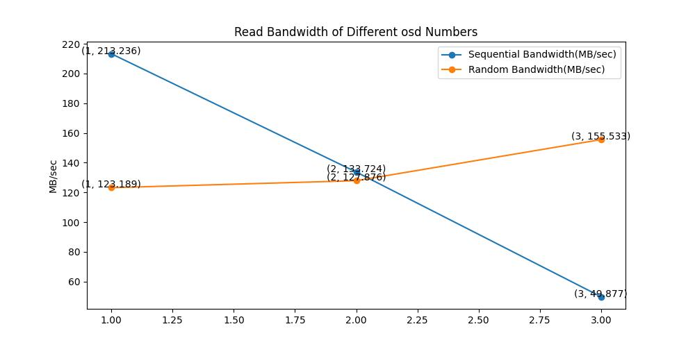

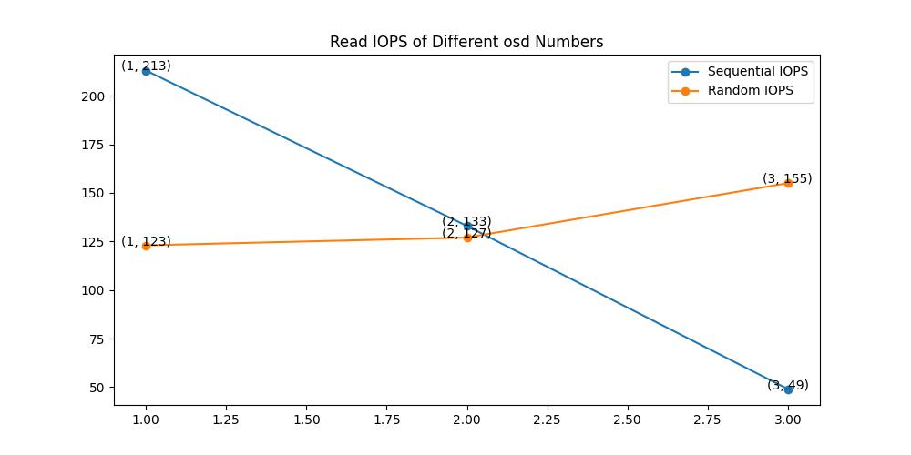

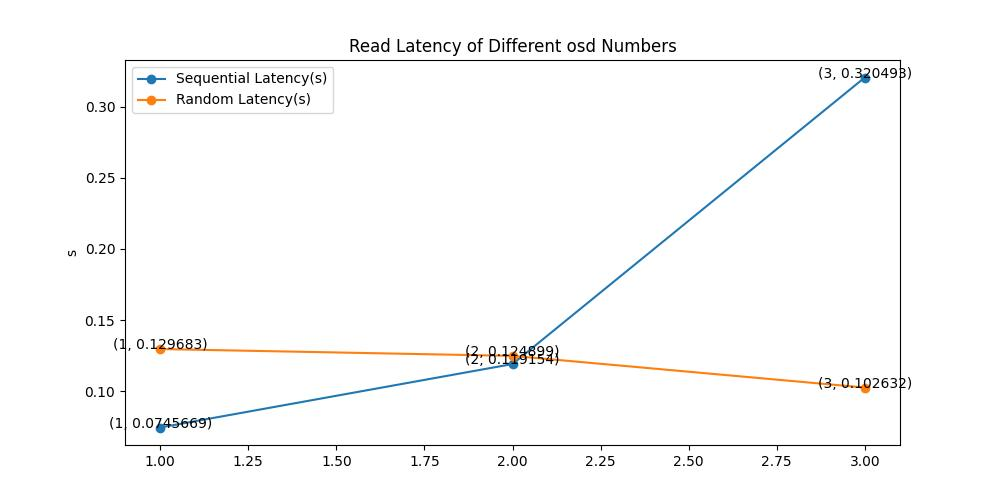

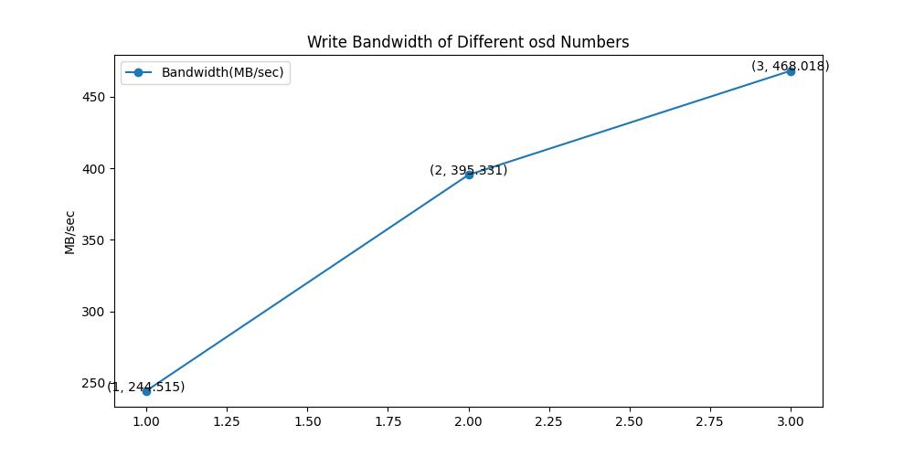

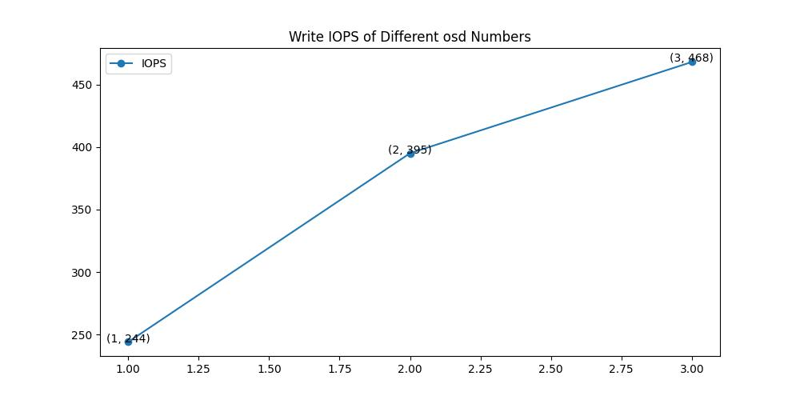

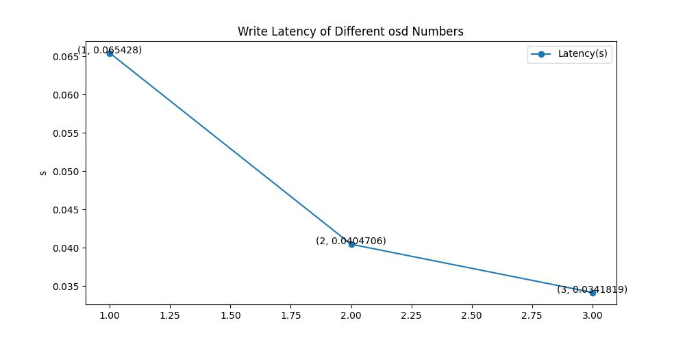

我们使用概率论与数理统计的知识进行分析，有力地证明 bandwidth 和 latency 两个指标优化达到了20%。

#### bandwidth

>: average bandwidth in 1 second

1osd：

| sec  |  (MB/s) |  (MB/s) |
| :--: | :------------------------------------------------------: | :----------------------------------------------------------: |
|  0   |                         154.502                          |                           185.4024                           |
|  1   |                          236.91                          |                           284.2956                           |
|  2   |                         245.316                          |                           294.3792                           |
|  3   |                          237.41                          |                           284.892                            |
|  4   |                         240.127                          |                           288.1524                           |
|  5   |                         240.464                          |                           288.5568                           |
|  6   |                         243.113                          |                           291.7356                           |
|  7   |                         241.376                          |                           289.6512                           |
|  8   |                          242.55                          |                            291.06                            |
|  9   |                         242.805                          |                           291.366                            |

2osd：

| sec  |  (MB/s) |
| :--: | :------------------------------------------------------: |
|  0   |                         259.605                          |
|  1   |                         381.911                          |
|  2   |                         397.347                          |
|  3   |                         393.969                          |
|  4   |                         398.649                          |
|  5   |                         394.582                          |
|  6   |                         396.047                          |
|  7   |                         397.656                          |
|  8   |                         396.699                          |
|  9   |                         396.017                          |

3osd：

| sec  |  (MB/s) |
| :--: | :------------------------------------------------------: |
|  0   |                         315.836                          |
|  1   |                         441.663                          |
|  2   |                         460.521                          |
|  3   |                         456.142                          |
|  4   |                         461.862                          |
|  5   |                         471.263                          |
|  6   |                         474.081                          |
|  7   |                         475.144                          |
|  8   |                         471.616                          |
|  9   |                         466.206                          |

在99.5%置信度下，要检验问题：“ 2osd 的比 1osd 的高20%”，即检验" 2osd 的大于 1osd 的“[。将其设置为对立假设，假设检验问题为


假设检验量为

}})

拒绝域取为\})。

做一些计算:

1osd: ，

2osd: ，

S_1^2+(n-1)S_2^2}{m+n-2}\approx 1469.612)

代入得=-2.878)，因此有足够的证据否定原假设，认为对立假设成立，即可以认为 2osd 的 write bandwidth 比 1osd 的 write bandwidth 性能高20%。

在99.5%置信度下，要检验问题：“ 3osd 的比 1osd 的高20%”，即检验" 3osd 的$bw_{avg}$大于osd1的“。将其设置为对立假设，假设检验问题为


假设检验量为

}})

拒绝域取为\})。

做一些计算:

1osd: ，

2osd: ，

S_1^2+(n-1)S_2^2}{m+n-2}\approx 1697.688)

代入得=-2.878)，因此有足够的证据否定原假设，认为对立假设成立，即可以认为 3osd 的 write bandwidth 比 1osd 的 write bandwidth 性能高20%。

#### latency

> : average latency in 1 second

1osd：

| sec |  (s) |  (s) |
| :---: | :-------------: | :------------------------: |
|   0   |    0.0733457    |         0.05867656         |
|   1   |    0.0627875    |          0.05023           |
|   2   |    0.0636084    |         0.05088672         |
|   3   |    0.0661597    |         0.05292776         |
|   4   |    0.0661789    |         0.05294312         |
|   5   |    0.0657598    |         0.05260784         |
|   6   |    0.0654685    |         0.0523748          |
|   7   |    0.0654549    |         0.05236392         |
|   8   |    0.0656566    |         0.05252528         |
|   9   |    0.0653354    |         0.05226832         |

2osd：

| sec |  (s) |
| :---: | :-------------: |
|   0   |    0.0482161    |
|   1   |    0.040804     |
|   2   |    0.0396624    |
|   3   |    0.0402444    |
|   4   |    0.0400131    |
|   5   |    0.0403615    |
|   6   |    0.040216     |
|   7   |    0.0401435    |
|   8   |    0.0401707    |
|   9   |    0.0403205    |

3osd：

| sec |  (s) |
| :---: | :-------------: |
|   0   |    0.0469811    |
|   1   |    0.0350493    |
|   2   |    0.0343215    |
|   3   |    0.0348378    |
|   4   |    0.0344481    |
|   5   |    0.0338161    |
|   6   |    0.0337161    |
|   7   |    0.033607     |
|   8   |    0.0338197    |
|   9   |    0.0342532    |

在99.5%置信度下，要检验问题：“ 2osd 的比 1osd 的低20%”，即检验" 2osd 的小于 1osd 的“。将其设置为对立假设，假设检验问题为


假设检验量为

}})

拒绝域取为\})。

做一些计算:

1osd: ，

2osd: ，

S_1^2+(n-1)S_2^2}{m+n-2}\approx 5.781\times 10^{-6})

代入得=2.878)，因此有足够的证据否定原假设，认为对立假设成立，即可以认为 2osd 的 write latency 比 1osd 的 write latency 性能高20%。

在99.5%置信度下，要检验问题：“ 3osd 的比 1osd 的低20%”，即检验" 3osd 的小于 1osd 的“。将其设置为对立假设，假设检验问题为


假设检验量为

}})

拒绝域取为\})。

做一些计算:

1osd: ，

3osd: ，

S_1^2+(n-1)S_2^2}{m+n-2}\approx 10.806\times 10^{-6})

代入得=2.878)，因此有足够的证据否定原假设，认为对立假设成立，即可以认为 3osd 的 write latency 比 1osd 的 write latency 性能高20%。

### pg numbers 对性能的影响

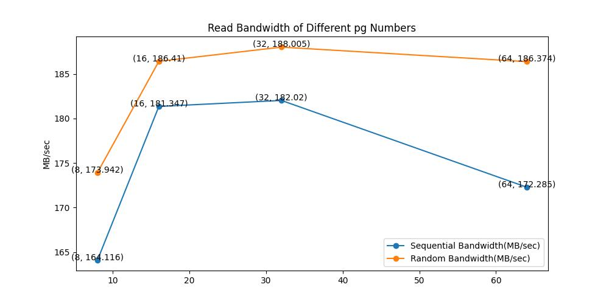

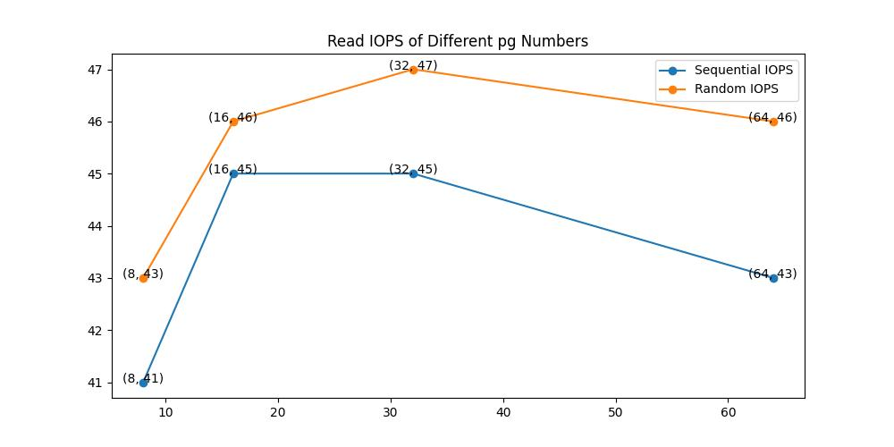

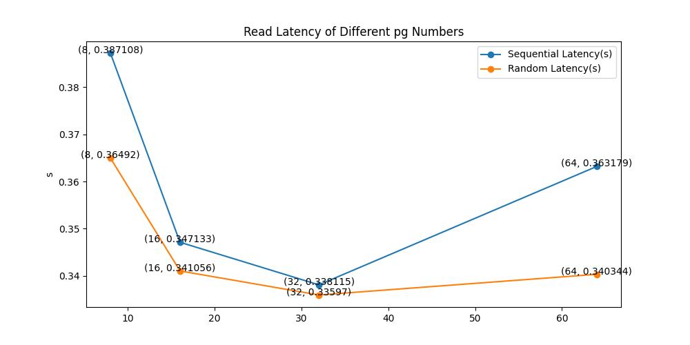

我们将pg从8调为32后，通过上面3张图可知，随机读带宽、随机读IOPS、随机读延迟、顺序读带宽、顺序读IOPS、顺序读延迟分别优化达到8.08%，9.30%，9.04%，10.91%，10.98%，13.77%。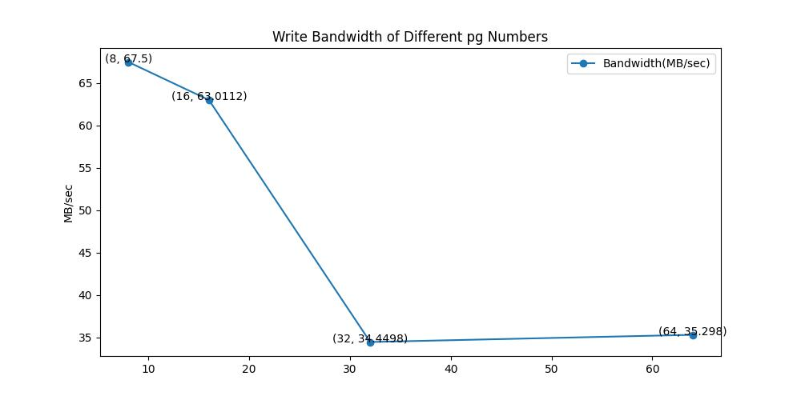

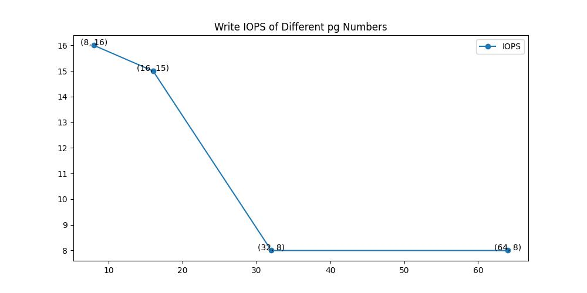

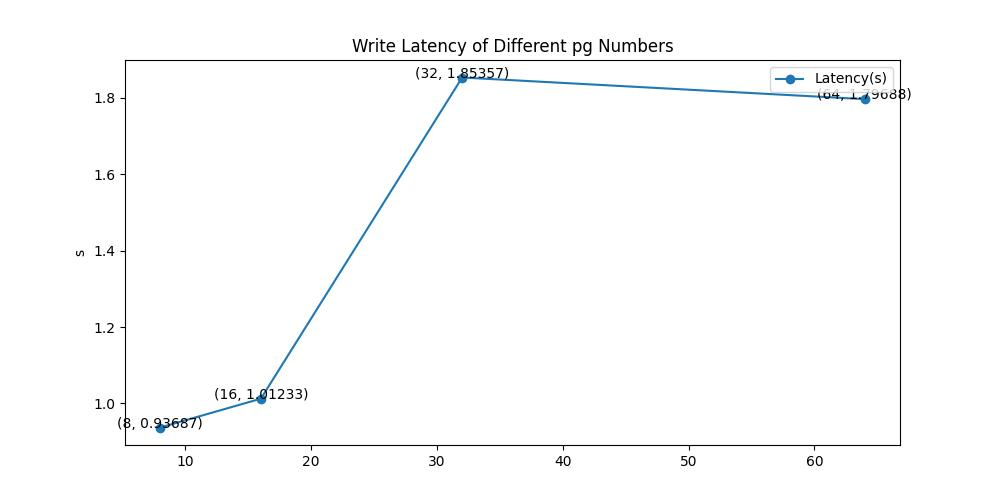

将pg从32调到8后，写带宽、写IOPS、写延迟分别优化达到95.94%，50.00%，50.54%。都达到了20%。其原因在于将每个存储池的 `placement of group ` 适当增加后，在写入时更容易找到一个适合写入的组，但是与此同时，读取时需要的效率会降低。


